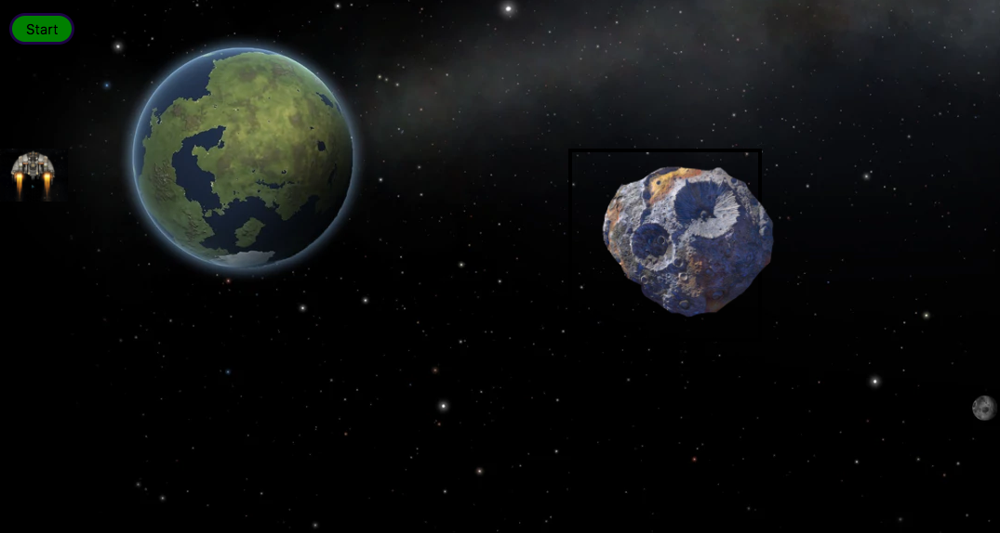

# Battlestar Andromeda

**The Game:** To make it across the universe without getting hit by an asteroid

[Play the game here](http://battlestarandromeda.bitballoon.com/)

## To Play

Move the spaceship  with the left, right, up, and down arrow keys across the galaxy.
If you go off the screen, then your spaceship appears at the opposite end of the screen so 
that you will stay within the galaxy's borders. There is a green timer progress bar at the bottom of the screen. If you can survive the flight until the green progress bar is up then you win the game. Can you survive? 




### languages used:
* Javascript
* Jquery
* CSS
* HTML

Algorithm I wrote to detect collision:

```
var $box1Pos = $box1.getBoundingClientRect();
var $box3Pos = $box3.getBoundingClientRect();

    if ($box1Pos.top < $box3Pos.top + $box3Pos.width &&
        $box1Pos.top + $box1Pos.width > $box3Pos.top &&
        $box1Pos.left < $box3Pos.left + $box3Pos.height &&
        $box1Pos.height + $box1Pos.left > $box3Pos.left) 
            {const $explode = $("#sound");
            $("#spaceshuttle").effect('explode')}

```
